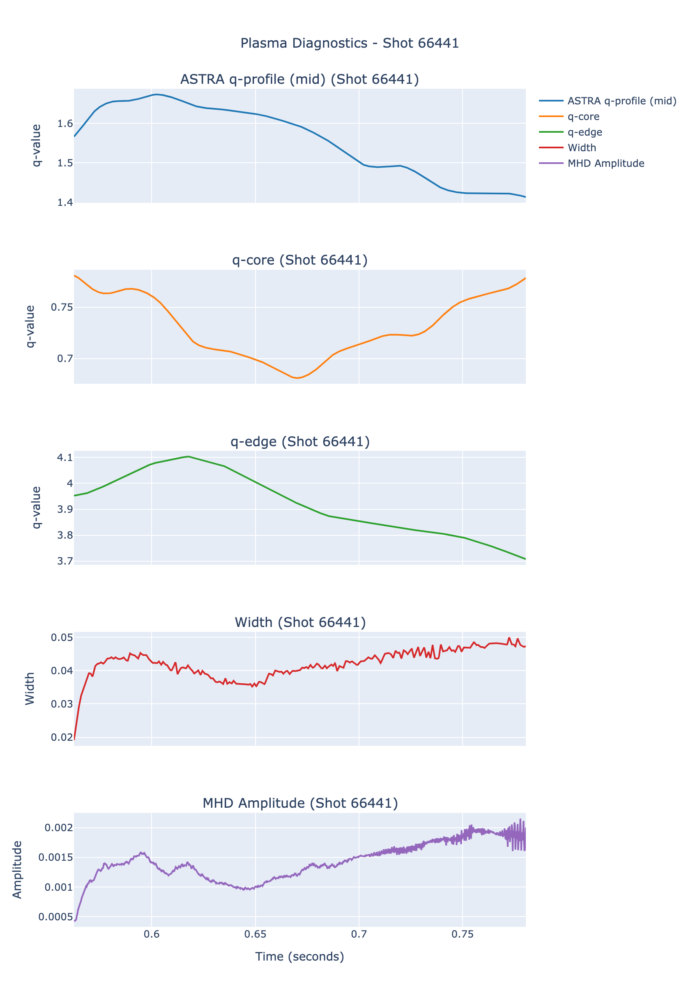
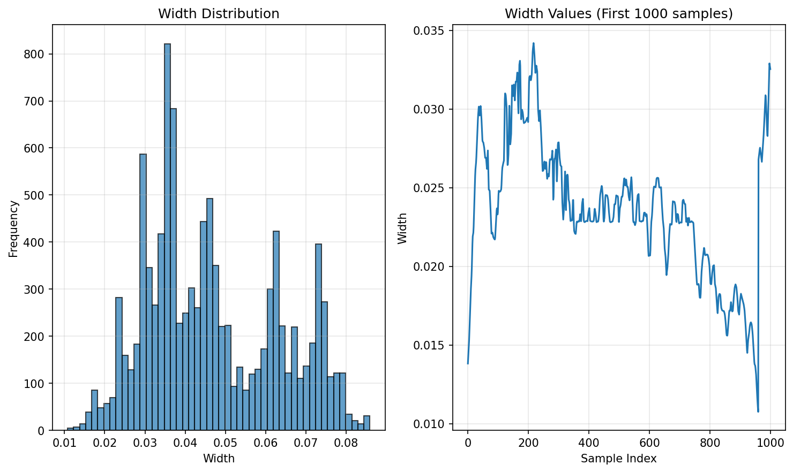
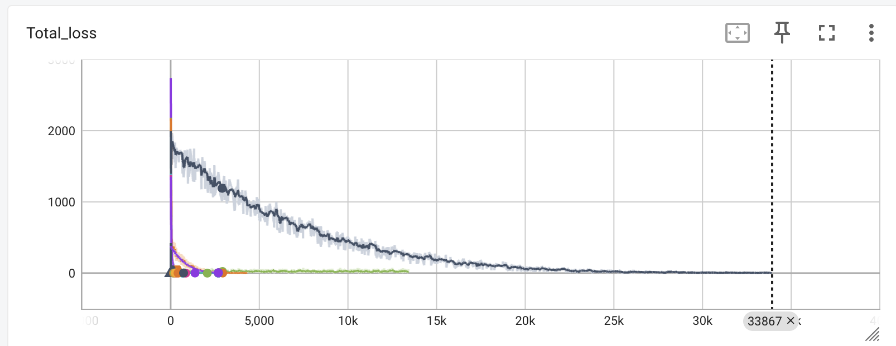

# Plasma Island Width Prediction Using Deep Learning

**Master's Project - Plasma Physics & Machine Learning**

A deep learning approach for predicting magnetic island width in tokamak plasmas using MHD amplitude and q-profile data from ASTRA simulations.

## 🎯 Objective

This project develops a neural network model to predict magnetic island width in fusion plasmas by analyzing:
- **Q-profile data**: Safety factor profiles across radial positions and time
- **MHD amplitude data**: Magnetohydrodynamic oscillation amplitudes over time

The model uses sliding window temporal sequences to capture the dynamic evolution of plasma instabilities and predict island width at specific time points.

## 📁 Project Structure

```
machine-learning/
├── data/                           # Raw H5 data files from ASTRA
│   ├── shot_60123_data.h5
│   ├── shot_66441_data.h5
│   └── shot_66674_data.h5 ...
├── simple_plasma_processor.py      # Interactive data validation tool
├── generate_dataset.py             # HuggingFace dataset generation
├── main.py                        # Model training pipeline
├── model.py                       # Neural network architecture
├── data_vis.ipynb                 # Data exploration notebook
├── processed_shots_summary.json   # Validated shots metadata
├── plasma_diagnostics_dataset/    # Processed HuggingFace dataset
└── artifacts/                     # Visualization outputs
    ├── image1.png
    ├── width_analysis.png
    └── runs.png
```

## 🔬 Scientific Background

Magnetic islands are plasma instabilities that can degrade confinement in tokamak fusion reactors. Early prediction of island evolution is crucial for:
- **Disruption avoidance**: Preventing plasma termination events
- **Performance optimization**: Maintaining optimal confinement regimes
- **Real-time control**: Enabling feedback systems for island mitigation

## 🛠️ Methodology

### Data Processing Pipeline

1. **Raw Data Extraction** (`simple_plasma_processor.py`)
   - Loads ASTRA simulation H5 files containing time series data
   - Handles temporal interpolation between different diagnostic sampling rates
   - Provides interactive validation interface for shot selection
   - Generates quality-controlled metadata in JSON format

2. **Dataset Generation** (`generate_dataset.py`)
   - Creates HuggingFace dataset from validated shots
   - Implements sliding window extraction (configurable window size)
   - Filters NaN values and ensures data consistency
   - Splits data into training/validation sets

3. **Model Training** (`main.py`)
   - Loads processed dataset with JAX integration
   - Implements custom data loader with batch shuffling
   - Tracks training metrics via TensorBoard
   - Saves model checkpoints using Equinox serialization

### Neural Network Architecture

The model (`model.py`) implements a **multi-modal convolutional architecture** designed to preserve spatial and temporal dependencies:

```python
Input Branches:
├── Q-Profile Branch: (batch, 40, 61) → Conv2D → Conv2D → Flatten
└── MHD Amplitude Branch: (batch, 40) → Conv1D → Flatten

Fusion Layer:
└── Concatenation → Dense(40) → Dense(1) → Island Width Prediction
```

**Architecture Rationale:**
- **Convolutional layers** preserve spatial correlations in q-profile data (radial positions) and temporal patterns in both inputs
- **Separate processing branches** allow specialized feature extraction for each data modality
- **Late fusion** combines processed features for final prediction
- **Sliding window approach** captures temporal evolution leading to island formation

### Technical Implementation

- **Framework**: JAX/Equinox for high-performance automatic differentiation
- **Data Management**: HuggingFace Datasets for efficient loading and preprocessing
- **Optimization**: Adam optimizer with configurable learning rates
- **Monitoring**: TensorBoard integration for training visualization
- **Reproducibility**: Fixed random seeds and deterministic operations

## 📊 Data Characteristics

### Input Features
- **Q-Profile Windows**: 40 timesteps × 61 radial positions (2D spatial-temporal)
- **MHD Amplitude Windows**: 40 timesteps (1D temporal)
- **Window Size**: Configurable (currently 40 timesteps)
- **Sampling Strategy**: Center-point prediction from sliding windows

### Target Variable Distribution



This generates a json file. Running the `generate_dataset.py` creates the `plasma_diagnostics_dataset` which will then be loaded in the `main.py` file to train the model.

Below is the distribution of the values our model should try to predict:



### Architecture

Because of the spatial and time dependency between the datapoints in the data fed to the model (For example, the positions of the sensors generating the q_profile data or the time steps between the various sensor readings for the amplitude) it makes sense to first apply convolutional layers to the input so that these dependencies are conserved, before concatenating both features so as to apply dense layers on top to finaly predict the relevant island width.

Note: Huggingface, JAX and other tools were selected for their performance and ease of use in handling large datasets and training models.

### Annex

Screenshot of tensorboard on which the model was iteratively fine-tuned:



*Figure 3: TensorBoard visualization showing iterative model fine-tuning and loss convergence*

### Model Performance Metrics
- **Loss Function**: Mean Squared Error (MSE) scaled by factor of 100
- **Training Strategy**: Sliding window with NaN filtering
- **Validation Split**: 80/20 train/test split with shuffling
- **Data Quality**: Automated filtering of invalid/NaN samples

## 🔧 Technical Challenges & Solutions

### 1. **Temporal Alignment**
- **Challenge**: Different sampling rates between MHD and q-profile diagnostics
- **Solution**: Interpolation and resampling in preprocessing pipeline

### 2. **Data Quality Control**
- **Challenge**: Inconsistent data quality across ASTRA simulations
- **Solution**: Interactive validation tool with manual shot selection

### 3. **Memory Efficiency**
- **Challenge**: Large time-series datasets with spatial dimensions
- **Solution**: HuggingFace datasets with on-demand loading and JAX compilation

### 4. **Model Stability**
- **Challenge**: NaN propagation during training
- **Solution**: Comprehensive NaN filtering and data validation checks

## 🎓 Academic Context

This work contributes to the field of **plasma physics** and **fusion energy research** by:

1. **Physics-Informed Architecture**: Incorporating domain knowledge about spatial/temporal correlations
2. **Real-Time Applicability**: Developing models suitable for future tokamak control systems
3. **Data-Driven Approach**: Leveraging simulation data to complement theoretical understanding
4. **Methodological Innovation**: Combining modern ML techniques with plasma diagnostic data

## 📚 Key Technologies

| Component | Technology | Purpose |
|-----------|------------|---------|
| **Deep Learning** | JAX/Equinox | High-performance neural networks |
| **Data Pipeline** | HuggingFace Datasets | Efficient data loading/preprocessing |
| **Optimization** | Optax | Advanced optimization algorithms |
| **Visualization** | TensorBoard, Matplotlib | Training monitoring and analysis |
| **Data Format** | HDF5 | Scientific data storage |
| **Simulation** | ASTRA | Tokamak plasma modeling |

## 🔮 Future Work

- **Multi-Modal Extensions**: Incorporate additional diagnostic signals
- **Real-Time Deployment**: Optimize for low-latency prediction in control systems
- **Transfer Learning**: Apply models across different tokamak configurations
- **Uncertainty Quantification**: Add Bayesian approaches for confidence estimation
- **Causal Analysis**: Investigate physical mechanisms learned by the model

## 📄 References

- ASTRA Documentation: Tokamak plasma simulation suite
- JAX Documentation: High-performance scientific computing
- Plasma Physics Literature: Magnetic island dynamics and control

---

**Author**: [Your Name]  
**Institution**: [Your University]  
**Project Type**: Master's Thesis  
**Year**: 2025